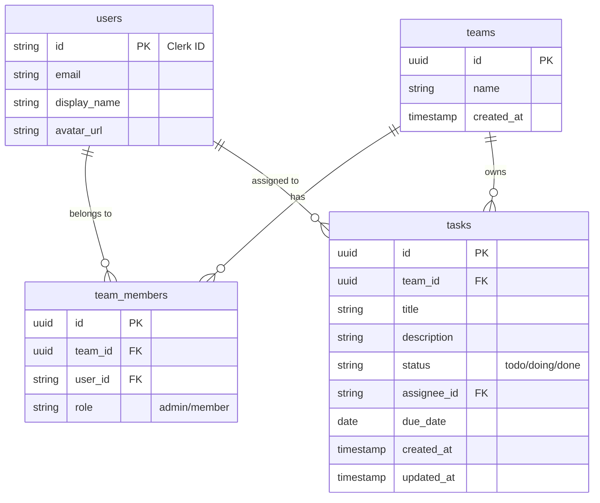

# データベース設計書

## 1. ER図

## 2. テーブル定義

### 2.1. users
Clerkのユーザー情報をSupabase側で参照・結合するために同期して保持するテーブル（またはView）。

| カラム名 | データ型 | 制約 | 説明 |
| :--- | :--- | :--- | :--- |
| `id` | `text` | PK | Clerkから提供されるUser ID |
| `email` | `text` | Not Null, Unique | メールアドレス |
| `display_name` | `text` | | 表示名 |
| `avatar_url` | `text` | | アバター画像のURL |
| `created_at` | `timestamptz` | Default: now() | 作成日時 |

### 2.2. teams
プロジェクトや組織の単位となるチーム。

| カラム名 | データ型 | 制約 | 説明 |
| :--- | :--- | :--- | :--- |
| `id` | `uuid` | PK, Default: uuid_generate_v4() | チームID |
| `name` | `text` | Not Null | チーム名 |
| `created_at` | `timestamptz` | Default: now() | 作成日時 |

### 2.3. team_members
ユーザーとチームの所属関係（多対多）を管理する中間テーブル。

| カラム名 | データ型 | 制約 | 説明 |
| :--- | :--- | :--- | :--- |
| `id` | `uuid` | PK, Default: uuid_generate_v4() | ID |
| `team_id` | `uuid` | FK (teams.id), Not Null | チームID |
| `user_id` | `text` | FK (users.id), Not Null | ユーザーID |
| `role` | `text` | Check ('admin', 'member') | 権限ロール |
| `joined_at` | `timestamptz` | Default: now() | 参加日時 |

*   **Index**: `(team_id, user_id)` でユニーク制約を作成し、重複参加を防ぐ。

### 2.4. tasks
タスク情報を管理するテーブル。

| カラム名 | データ型 | 制約 | 説明 |
| :--- | :--- | :--- | :--- |
| `id` | `uuid` | PK, Default: uuid_generate_v4() | タスクID |
| `team_id` | `uuid` | FK (teams.id), Not Null | 所属チームID |
| `title` | `text` | Not Null | タスク名 |
| `description` | `text` | | タスク詳細・備考 |
| `status` | `text` | Default 'todo', Check ('todo', 'doing', 'done') | 進捗ステータス |
| `assignee_id` | `text` | FK (users.id), Not Null | 担当者ID |
| `due_date` | `date` | Not Null | 期限日 |
| `created_at` | `timestamptz` | Default: now() | 作成日時 |
| `updated_at` | `timestamptz` | Default: now() | 更新日時 |

## 3. Row Level Security (RLS) ポリシー方針

*   **users**: 認証済みユーザーは全員のBasic情報（名前、アバター）を参照可能（チーム内コラボレーションのため）。
*   **teams**: 自分が `team_members` に含まれるチームのみ参照可能。
*   **team_members**: 自分が所属するチームのメンバーリストのみ参照可能。
*   **tasks**: 自分が所属するチーム（`team_id` が一致し、かつそのチームのメンバーである）のタスクのみ、参照・作成・更新・削除が可能。

