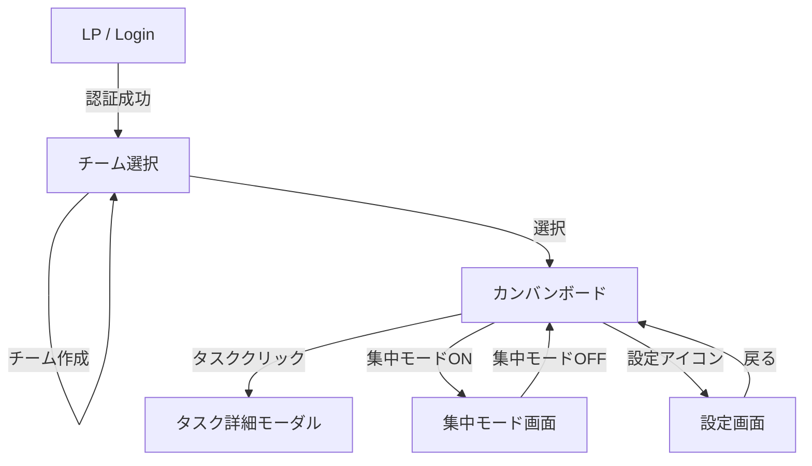

# UI/UXデザイン設計書

## 1. デザインコンセプト

**Concept: "Zen & Focus" (禅と集中)**
余計な装飾を削ぎ落とし、ユーザーが「今やるべきこと」だけに集中できる、静寂でクリアなインターフェースを目指します。

### 1.1. カラーパレット

| 用途 | カラーコード | Tailwind Class | 説明 |
| :--- | :--- | :--- | :--- |
| **Background** | `#F9FAFB` / `#111827` | `bg-gray-50` / `dark:bg-gray-900` | ベースとなる背景色。目に優しい低コントラスト。 |
| **Surface** | `#FFFFFF` / `#1F2937` | `bg-white` / `dark:bg-gray-800` | カードやモーダルの背景。 |
| **Primary** | `#3B82F6` | `text-blue-500` | アクションボタン、リンク、アクティブ状態。落ち着いた青。 |
| **Text Main** | `#1F2937` / `#F3F4F6` | `text-gray-800` / `dark:text-gray-100` | 主要なテキスト。完全な黒ではなくダークグレー。 |
| **Text Sub** | `#6B7280` / `#9CA3AF` | `text-gray-500` / `dark:text-gray-400` | 補足情報、メタデータ。 |
| **Alert** | `#EF4444` | `text-red-500` | **唯一の強いアクセント**。期限切れやエラー時のみ使用。 |

### 1.2. タイポグラフィ
*   **Font Family**: Inter, Noto Sans JP, sans-serif
*   **Weights**:
    *   Regular (400): 本文
    *   Medium (500): ラベル、ボタン
    *   Bold (700): 見出し、強調

## 2. 画面一覧と遷移

## 3. 主要画面ワイヤーフレーム / 詳細設計

### 3.1. カンバンボード (Dashboard)
アプリのメイン画面。3カラム固定のボードレイアウト。

**Layout Structure:**
*   **Header**:
    *   Left: ロゴ、チーム切り替えドロップダウン
    *   Center: 空白（または日付表示）
    *   Right: **集中モードトグルスイッチ**、通知インジケータ、ユーザーアイコン
*   **Board Area**:
    *   3カラム: `TODO (未着手)`, `DOING (作業中)`, `DONE (完了)`
    *   各カラムは縦スクロール可能。
    *   右下にFloating Action Button (FAB) で「＋タスク追加」。

**Task Card UI:**
*   シンプルさを極めるため、以下の情報のみを表示。
    *   上段: タスク名（2行まで省略なし）
    *   下段: 担当者アバター（小）、期限日
*   **期限切れの場合**: 枠線または期限日テキストを赤色（Alert Color）に変更。

### 3.2. 集中モード画面 (Focus Mode)
カンバンボードから遷移する、作業特化型の画面。

**UI Changes:**
*   **Navigation**: ヘッダーのロゴやチーム切り替え、ユーザーメニューを非表示化（または薄くグレーアウト）。
*   **Timer**: 画面上部中央にカウントダウンタイマーを大きく表示（例: `24:59`）。
*   **Filter**:
    *   自分の担当タスクのみ表示。
    *   「DONE」カラムを非表示にし、「TODO」と「DOING」のみ（あるいは「DOING」のみ）にフォーカスさせるオプションも検討。
*   **Notification**: アプリ内通知を一切表示しない。

### 3.3. タスク追加/詳細モーダル
タスクの作成・編集を行うモーダルダイアログ。

**Components:**
*   **Title Input**: 大きな文字サイズの入力フィールド。
*   **Assignee Select**: メンバーのリスト（アバター付き）から選択。デフォルトは自分。
*   **Due Date Picker**: カレンダーピッカー。デフォルトは今日または明日。
*   **Description**: テキストエリア（Markdown対応はMVPでは見送り、プレーンテキスト）。
*   **Action Buttons**: 「削除」（編集時のみ、赤字）、「キャンセル」、「保存/作成」（Primary Color）。

