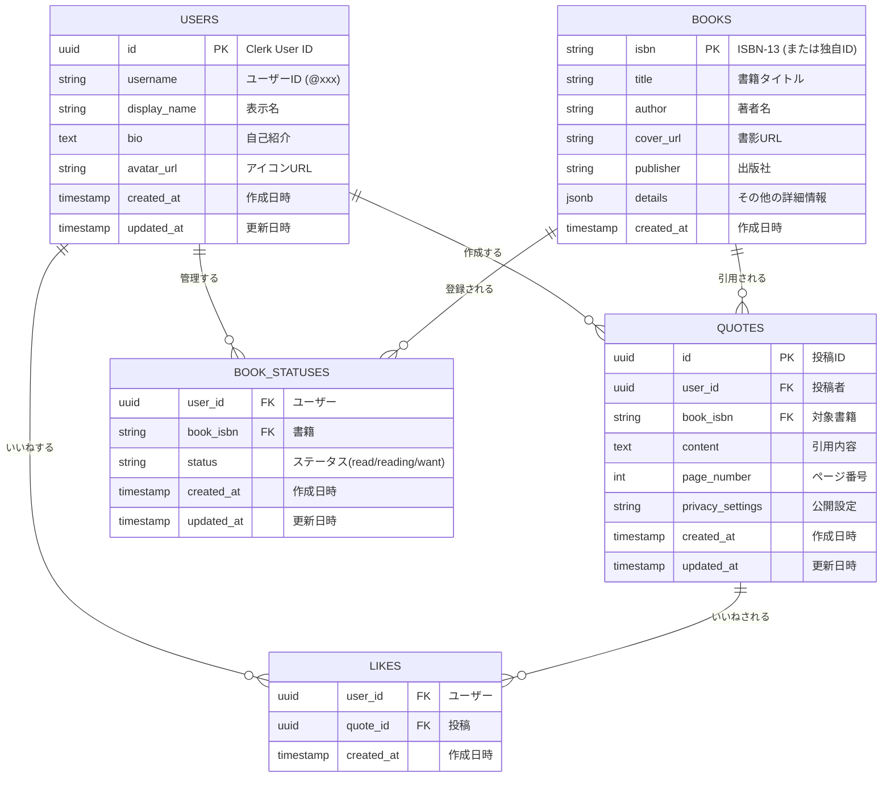

# データベース設計書

## 1. 概要

本システムのデータベースには **PostgreSQL** (Supabase) を採用します。
JSON型データを柔軟に扱えるPostgreSQLの特性を活かし、将来的な機能拡張（例: 書籍情報の詳細化など）に対応できる設計とします。また、Row Level Security (RLS) を設定し、データベース層での堅牢なアクセス制御を実現します。

## 2. ER図

## 3. テーブル定義

### 3.1 `users`
アプリケーションのユーザー情報を管理するテーブル。認証基盤（Clerk）のユーザーIDを主キーとして同期的に管理します。

| カラム名 | データ型 | 制約 | 説明 |
| :--- | :--- | :--- | :--- |
| `id` | `uuid` | **PK** | Clerkから提供されるUser IDと一致させる。 |
| `username` | `varchar(50)` | **UNIQUE**, NOT NULL | ユーザー識別ID（@メンション用）。英数字のみ。 |
| `display_name` | `varchar(100)` | NOT NULL | 画面表示用の名前。 |
| `bio` | `text` | | 自己紹介文。 |
| `avatar_url` | `text` | | ユーザーアイコン画像のURL。 |
| `created_at` | `timestamptz` | DEFAULT `now()` | レコード作成日時。 |
| `updated_at` | `timestamptz` | DEFAULT `now()` | レコード更新日時。 |

### 3.2 `books`
引用対象となる書籍の情報を管理するテーブル。Google Books API等から取得したデータをキャッシュとして保存します。

| カラム名 | データ型 | 制約 | 説明 |
| :--- | :--- | :--- | :--- |
| `isbn` | `varchar(20)` | **PK** | ISBN-13コードを基本とする。ISBNがない場合は独自ID。 |
| `title` | `varchar(255)` | NOT NULL | 書籍のタイトル。 |
| `author` | `varchar(255)` | | 著者名（複数の場合はカンマ区切り等を想定）。 |
| `cover_url` | `text` | | 書影画像のURL。 |
| `publisher` | `varchar(100)` | | 出版社名。 |
| `details` | `jsonb` | DEFAULT `{}` | その他のメタデータ（出版日、説明文など）を格納。 |
| `created_at` | `timestamptz` | DEFAULT `now()` | レコード作成日時。 |

### 3.3 `quotes`
ユーザーによる引用投稿を管理する主要テーブル。

| カラム名 | データ型 | 制約 | 説明 |
| :--- | :--- | :--- | :--- |
| `id` | `uuid` | **PK**, DEFAULT `gen_random_uuid()` | 投稿を一意に識別するID。 |
| `user_id` | `uuid` | **FK** (`users.id`), NOT NULL | 投稿したユーザーのID。 |
| `book_isbn` | `varchar(20)` | **FK** (`books.isbn`), NOT NULL | 引用元の書籍ISBN。 |
| `content` | `text` | NOT NULL | 引用された文章。最大文字数制限あり。 |
| `page_number` | `int` | | 引用箇所のページ番号（任意）。 |
| `privacy_settings` | `varchar(20)` | DEFAULT `'public'`, CHECK(...) | 公開設定 (`public`, `followers`, `private`)。 |
| `created_at` | `timestamptz` | DEFAULT `now()` | 投稿日時。 |
| `updated_at` | `timestamptz` | DEFAULT `now()` | 編集日時。 |

### 3.4 `likes`
投稿に対する「いいね」を管理する中間テーブル。

| カラム名 | データ型 | 制約 | 説明 |
| :--- | :--- | :--- | :--- |
| `user_id` | `uuid` | **PK**, **FK** (`users.id`) | いいねしたユーザー。 |
| `quote_id` | `uuid` | **PK**, **FK** (`quotes.id`) | いいねされた投稿。 |
| `created_at` | `timestamptz` | DEFAULT `now()` | いいねした日時。 |

*備考: `user_id` と `quote_id` の複合主キーとします。*

### 3.5 `book_statuses`
ユーザーごとの読書状態（本棚）を管理するテーブル。

| カラム名 | データ型 | 制約 | 説明 |
| :--- | :--- | :--- | :--- |
| `user_id` | `uuid` | **PK**, **FK** (`users.id`) | ユーザーID。 |
| `book_isbn` | `varchar(20)` | **PK**, **FK** (`books.isbn`) | 書籍ISBN。 |
| `status` | `varchar(20)` | NOT NULL, CHECK(...) | 状態 (`read`=読了, `reading`=読書中, `want_to_read`=積読)。 |
| `created_at` | `timestamptz` | DEFAULT `now()` | 登録日時。 |
| `updated_at` | `timestamptz` | DEFAULT `now()` | ステータス更新日時。 |

*備考: `user_id` と `book_isbn` の複合主キーとします。*

## 4. セキュリティポリシー (RLS)

Supabase (PostgreSQL) の Row Level Security を有効化し、以下のポリシーを適用します。

- **`users`**:
  - `SELECT`: 全員許可 (Public)。
  - `UPDATE`: `auth.uid() = id` の場合のみ許可（自分のみ）。
- **`books`**:
  - `SELECT`: 全員許可。
  - `INSERT`: 認証済みユーザーのみ許可。
- **`quotes`**:
  - `SELECT`:
    - `privacy_settings = 'public'` の場合は全員許可。
    - `privacy_settings = 'private'` の場合は `auth.uid() = user_id` のみ許可。
  - `INSERT`: 認証済みユーザーのみ許可。
  - `UPDATE/DELETE`: `auth.uid() = user_id` の場合のみ許可。
- **`likes`**:
  - `SELECT`: 全員許可。
  - `INSERT/DELETE`: `auth.uid() = user_id` の場合のみ許可。

