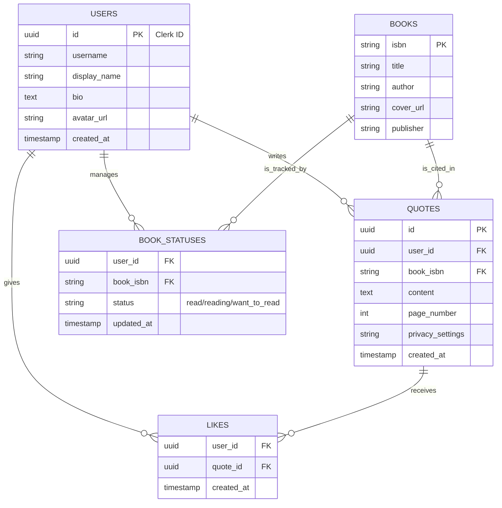

# 詳細要件定義書：言葉の栞（ことばのしおり）

**バージョン**: 1.0
**作成日**: 2026年1月19日
**作成者**: AI Assistant

## 1. プロジェクト概要

### 1.1 背景と目的
「言葉の栞（ことばのしおり）」は、読書体験の中で出会う「心に刺さった一行」を記録・共有することに特化したSNSです。
既存のSNSでは長文感想が投稿しづらく、読書管理アプリは事務的すぎるというデジタルネイティブ世代（20-30代）の不満を解消し、「本」単位ではなく「言葉」単位での新しい本との出会いと、共感ベースのコミュニティを創出することを目的とします。

### 1.2 スコープ
本プロジェクトでは、モバイル利用を最優先としたWebアプリケーション（PWA）の開発を行います。
初期フェーズ（MVP）では、コア機能である「引用投稿」「タイムライン」「検索」の実装に注力し、Phase 2以降で機能拡張を行います。

## 2. ビジネス要件

### 2.1 リーンキャンバス（要約）
- **課題**: 読書感想を気軽にシェアできる場がない、既存アプリは事務的でエモさがない。
- **解決策**: 「一行」にフォーカスした引用投稿SNS。
- **独自の価値提案**: 感性で繋がる読書体験、美しい読書メモのデジタル化。
- **優位性**: ターゲット世代に響く「Minimal & Energetic」なUI/UX。
- **顧客セグメント**: 20-30代の読書愛好家、デジタルネイティブ層。
- **収益の流れ**: アフィリエイト（Phase 2以降）、プレミアムプラン（将来構想）。

### 2.2 KGI / KPI
- **KGI (重要目標達成指標)**: 若年層読書コミュニティのシェアNo.1
- **KPI (重要業績評価指標)**:
    - **MAU (Monthly Active Users)**: ローンチ3ヶ月で1,000人、1年後に50,000人。
    - **投稿継続率**: 初回投稿ユーザーの翌月投稿率 20%。
    - **投稿数**: 1ユーザーあたり月平均3件以上の引用投稿。

## 3. ユーザー要件

### 3.1 ターゲットユーザー / ペルソナ
**(仮定)**
- **名前**: 佐藤 栞 (26歳)
- **職業**: 都内IT企業勤務のマーケター
- **属性**: デジタルネイティブ、Instagram/Xユーザー。
- **性格**: 感受性が豊かで、小説やエッセイの一節に心を動かされることが多い。
- **課題**: 読書中に素敵な言葉を見つけても、手帳に書くのは面倒だし、Xに書くほどでもない（または文脈がないと伝わらない）と感じている。
- **ニーズ**: 読んだ本の記録を美しく残したい。同じ感性を持つ人と繋がりたい。

### 3.2 ユーザーストーリー
1. **記録**: ユーザーとして、読書中に見つけた心に響く一文を、出典情報と共に手軽に美しく記録したい。
2. **発見**: ユーザーとして、自分の感性に合う「言葉」を通じて、今まで知らなかった面白い本に出会いたい。
3. **共感**: ユーザーとして、自分の投稿した言葉に対して「いいね」をもらい、感性が肯定されたと感じたい。
4. **管理**: ユーザーとして、過去に投稿した言葉や読んだ本を振り返り、自分の読書履歴として管理したい。

## 4. 機能要件

### 4.1 機能一覧 (MoSCoW分析)

| 分類 | 機能名 | 概要 |
| :--- | :--- | :--- |
| **Must** (必須) | ユーザー認証 | アカウント作成、ログイン/ログアウト (Clerk) |
| **Must** | プロフィール管理 | ユーザー名、自己紹介、アイコン設定 |
| **Must** | 引用投稿 | テキスト入力、書籍検索・紐付け、公開設定 |
| **Must** | タイムライン | フォロー中・おすすめ投稿の表示、無限スクロール |
| **Must** | 書籍検索 | Google Books API連携による書籍特定 |
| **Must** | キーワード検索 | 投稿、ユーザー、書籍の検索 |
| **Must** | いいね機能 | 投稿へのハート付与 |
| **Should** (推奨) | 読書ステータス | 読了、積読、読書中の管理 |
| **Should** (推奨) | シェア機能 | X, Instagram等へのシェア |
| **Should** (推奨) | ページ数記録 | 引用元のページ番号記録 |
| **Should** (推奨) | タグ付け | #人生 #恋愛 などのタグ付与 |
| **Could** (可能なら) | コメント機能 | 投稿へのコメント (Phase 3) |
| **Could** | 画像添付 | ページの写真等の添付 (Phase 2) |
| **Could** | トレンド表示 | 人気のタグや書籍の表示 (Phase 2) |
| **Won't** (今回は対象外) | DM機能 | ユーザー間の直接メッセージ |
| **Won't** | アフィリエイト | 書籍購入リンクの自動生成 (Phase 2以降) |

### 4.2 機能詳細仕様 (主要機能)

#### 4.2.1 引用投稿機能
- **ユースケース**: ユーザーが本を読んでいて気になった一節を投稿する。
- **フロー**:
    1.  ヘッダーまたはフッターの「投稿」ボタン（＋アイコン）を押下。
    2.  投稿画面モーダルが開く。
    3.  引用テキストを入力（必須）。
    4.  「本を選択」ボタンを押し、書籍検索モーダルでタイトルを入力して書籍を選択（必須）。
    5.  ページ数（任意）、タグ（任意）、公開範囲（公開/フォロワーのみ/自分のみ）を設定。
    6.  「投稿する」ボタンを押下。
    7.  投稿完了トーストを表示し、タイムラインまたは自プロフィールへ遷移。
- **UI要件**:
    -   投稿ボタンはアクセントカラー（イエローグラデーション）で強調。
    -   書籍選択時は書影（表紙画像）を表示し、視覚的に分かりやすくする。

#### 4.2.2 タイムライン機能
- **ユースケース**: アプリを開いて、他のユーザーの投稿を眺める。
- **フロー**:
    1.  ホーム画面を表示。
    2.  デフォルトで「おすすめ」または「フォロー中」のタブが表示される。
    3.  スクロールすると次々と新しい投稿カードがロードされる（無限スクロール）。
    4.  気になった投稿の「いいね」ボタンをタップする。
- **UI要件**:
    -   カード型デザイン（白背景）。
    -   引用文を大きく配置し、可読性を確保。
    -   書影はサムネイルとして控えめに配置。

## 5. UI/UX設計

### 5.1 デザインコンセプト
- **コンセプト**: 「Minimal & Energetic」
- **基本方針**:
    -   **Minimal**: コンテンツ（言葉）を主役にするため、ベースは白と黒のモノトーンで構成。余計な装飾を排除。
    -   **Energetic**: 「刺さる」「閃く」といった感情の動きを、イエローからオレンジへの鮮やかなグラデーションで表現。アクションボタンやアクティブ状態に使用。

### 5.2 カラーパレット / タイポグラフィ
- **カラー**:
    -   **Primary Black**: `#000000` (文字、アイコン)
    -   **Background White**: `#FFFFFF` (背景)
    -   **Surface Gray**: `#F5F5F5` (入力フォーム、境界線)
    -   **Accent Gradient**: `linear-gradient(135deg, #FFFC00 0%, #FFA500 100%)` (主要ボタン、いいねActive)
- **タイポグラフィ**:
    -   **Font Family**: `Noto Sans JP`, `Roboto`, `-apple-system`
    -   **H1 (Page Title)**: 24px Bold
    -   **Body (Quote)**: 16px Regular (行間 1.8 - ゆったりと)
    -   **Caption**: 12px Gray

### 5.3 画面遷移図 (Mermaid)

```mermaid
graph TD
    Login[ログイン/登録画面] --> Home[ホーム(タイムライン)]
    Home --> Post[投稿作成モーダル]
    Home --> Search[検索画面]
    Home --> Profile[プロフィール画面]
    Home --> Notification[通知画面]
    
    Post --> BookSearch[書籍検索モーダル]
    
    Search --> SearchResult[検索結果]
    
    Profile --> EditProfile[プロフィール編集]
    Profile --> FollowList[フォロー/フォロワー一覧]
    Profile --> BookList[本棚(読書管理)]
    
    BookList --> BookDetail[書籍詳細(関連投稿一覧)]
    Home --> PostDetail[投稿詳細画面]
```

### 5.4 主要画面ワイヤーフレーム

**1. ホーム画面 (タイムライン)**
```
+-----------------------------------+
|  Logo           [Search] [Notify] |
+-----------------------------------+
|  [ おすすめ ]  [ フォロー中 ]     | <- タブ (Activeはグラデーション下線)
+-----------------------------------+
| +-------------------------------+ |
| | User Icon  User Name    2h ago| |
| |                               | |
| | "人間は考える葦である"        | | <- 引用文 (大きめ)
| |                               | |
| | [書影] パスカル『パンセ』     | |
| |                               | |
| | [♡ 12]  [💬 2]  [Bookmark]    | |
| +-------------------------------+ |
|                                   |
| (Scroll for more...)              |
+-----------------------------------+
| [Home] [Search]  (+)  [Book] [Me] | <- フッターナビ (+はFABで強調)
+-----------------------------------+
```

**2. 投稿作成画面 (モーダル)**
```
+-----------------------------------+
| [x] キャンセル           投稿する | <- 投稿ボタンはグラデーション
+-----------------------------------+
|                                   |
|  ここに引用したい言葉を入力...    |
|  (最大500文字)                    |
|                                   |
+-----------------------------------+
| [ 書籍を選択してください >      ] |
| [ ページ数 (任意)               ] |
+-----------------------------------+
| Tags: #人生 #哲学 [+]             |
+-----------------------------------+
| 公開設定: [ 全体公開 v ]          |
+-----------------------------------+
```

## 6. 非機能要件
1.  **レスポンス**: Optimistic UIを採用し、「いいね」等のアクションは即時反映させる。API応答は平均200ms以内を目指す。
2.  **セキュリティ**: 通信は全てHTTPS化。認証情報はClerkによりセキュアに管理。データベースのRLS (Row Level Security) を適切に設定。
3.  **可用性**: Vercel/SupabaseのSLAに準拠。データバックアップはSupabaseのPITRを利用（プラン依存）。
4.  **デバイス**: スマートフォン (iOS/Android) のブラウザでの表示・操作を最適化 (Responsive Design)。

## 7. データベース設計

### 7.1 ER図 (Mermaid)



### 7.2 主要テーブル定義

**1. users (ユーザー)**
| カラム名 | データ型 | 制約 | 説明 |
| :--- | :--- | :--- | :--- |
| `id` | UUID | PK | ClerkのUser IDと同期 |
| `username` | VARCHAR(50) | UNIQUE, NOT NULL | ユーザーID (@xxx) |
| `display_name` | VARCHAR(100) | NOT NULL | 表示名 |
| `bio` | TEXT | | 自己紹介 |
| `avatar_url` | TEXT | | アイコン画像URL |
| `created_at` | TIMESTAMPTZ | DEFAULT NOW() | 作成日時 |

**2. quotes (引用投稿)**
| カラム名 | データ型 | 制約 | 説明 |
| :--- | :--- | :--- | :--- |
| `id` | UUID | PK, DEFAULT gen_random_uuid() | 投稿ID |
| `user_id` | UUID | FK(users.id), NOT NULL | 投稿者ID |
| `book_id` | VARCHAR | FK(books.isbn), NOT NULL | 書籍ISBN |
| `content` | TEXT | NOT NULL | 引用本文 |
| `page_number` | INTEGER | | ページ番号 |
| `privacy` | VARCHAR(20) | DEFAULT 'public' | 公開設定 |

## 8. インテグレーション要件

### 8.1 外部サービス
-   **認証**: **Clerk** (認証管理、セッション管理)
-   **DB/Backend**: **Supabase** (PostgreSQL, Realtime, Storage)
-   **書籍情報**: **Google Books API** (書籍検索、書影取得)
-   **ホスティング**: **Vercel**

### 8.2 API仕様 (抜粋)
Next.js Server Actionsを使用するため、厳密なREST APIエンドポイントは公開しないが、論理的なインターフェースは以下の通り。

-   `GET /api/books/search?q={query}`
    -   Google Books APIをラップし、検索結果を整形して返す。
-   `POST /actions/createQuote`
    -   Body: `{ bookId, content, page, privacy }`
    -   書籍データがDBにない場合は先に`books`テーブルに登録してから`quotes`を作成する。

## 9. 技術選定とアーキテクチャ

### 9.1 アーキテクチャ概要 (Mermaid)

```mermaid
graph TD
    Client[Client Browser (PWA)]
    
    subgraph Vercel
        NextApp[Next.js App Router]
        APIRoute[API Routes / Server Actions]
    end
    
    subgraph External
        Clerk[Clerk Auth]
        Google[Google Books API]
    end
    
    subgraph Supabase
        Postgres[(PostgreSQL)]
        Realtime[Realtime Engine]
    end
    
    Client -->|HTTPS/Page Load| NextApp
    Client -->|Auth| Clerk
    NextApp -->|Auth Check| Clerk
    NextApp -->|DB Query| Postgres
    NextApp -->|Fetch Book Info| Google
    Client -->|Subscribe| Realtime
    Realtime -->|Update Event| Client
```

### 9.2 コンポーネント階層図 (Mermaid)

```mermaid
graph TD
    Layout[RootLayout (Server)]
    Layout --> AuthProvider[ClerkProvider (Client)]
    AuthProvider --> Header[Header (Client)]
    AuthProvider --> PageContent[Page Content]
    
    subgraph Timeline Page
        PageContent --> FeedContainer[FeedContainer (Server)]
        FeedContainer --> FeedList[FeedList (Client)]
        FeedList --> QuoteCard[QuoteCard (Server/Client)]
        QuoteCard --> LikeButton[LikeButton (Client)]
    end
```

### 9.3 コンポーネント設計方針
-   **Server Components**: データフェッチ（DBアクセス）、メタデータ設定、静的コンテンツのレンダリングに使用。可能な限りServer Componentとして実装し、バンドルサイズを削減する。
-   **Client Components**: `useState`や`useEffect`が必要なインタラクティブなUI（いいねボタン、フォーム入力、モーダル制御）に使用。
-   **状態管理**:
    -   単一コンポーネント内: `useState`
    -   アプリケーション全体（モーダル開閉、トースト通知）: `Zustand` または `Jotai` (軽量なライブラリを選定)
    -   サーバーデータキャッシュ: Next.jsのCache機能 + `SWR` or `React Query` (必要に応じて)

## 10. リスクと課題
-   **著作権**: 引用の範囲を超えた投稿が行われるリスク。
    -   *対策*: 投稿ガイドラインの明示、入力文字数制限、通報機能の実装。
-   **API制限**: Google Books APIのレート制限に抵触する可能性。
    -   *対策*: 検索結果のキャッシュ、検索リクエストのデバウンス処理。

## 11. ランニング費用と運用方針
**(仮定: 初期リリース時)**
-   **Vercel**: Hobby Plan (無料) - 商用利用規模拡大時にPro ($20/mo) へ移行。
-   **Supabase**: Free Plan (無料) - DB容量500MBまで。拡大時にPro ($25/mo) へ移行。
-   **Clerk**: Free Plan (無料) - MAU 10,000人まで。
-   **運用**: CI/CDパイプライン (GitHub Actions + Vercel) による自動デプロイ。エラー監視はVercel AnalyticsまたはSentry (無料枠) を導入。

## 12. 変更管理
-   v1.0: 初版作成 (MVP要件定義)

## 13. 参考資料
-   `docs/output/system_requirements.md`: システム要件定義書
-   `読書SNS「言葉の栞」詳細機能仕様書とデザインシステム.html`: 元仕様書

