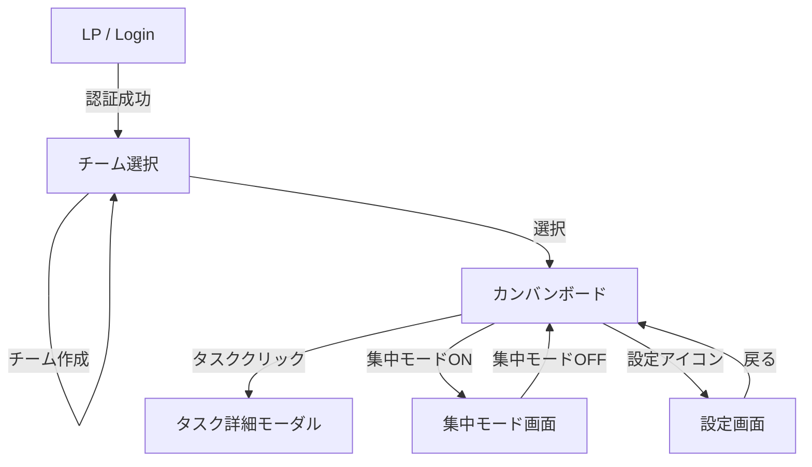
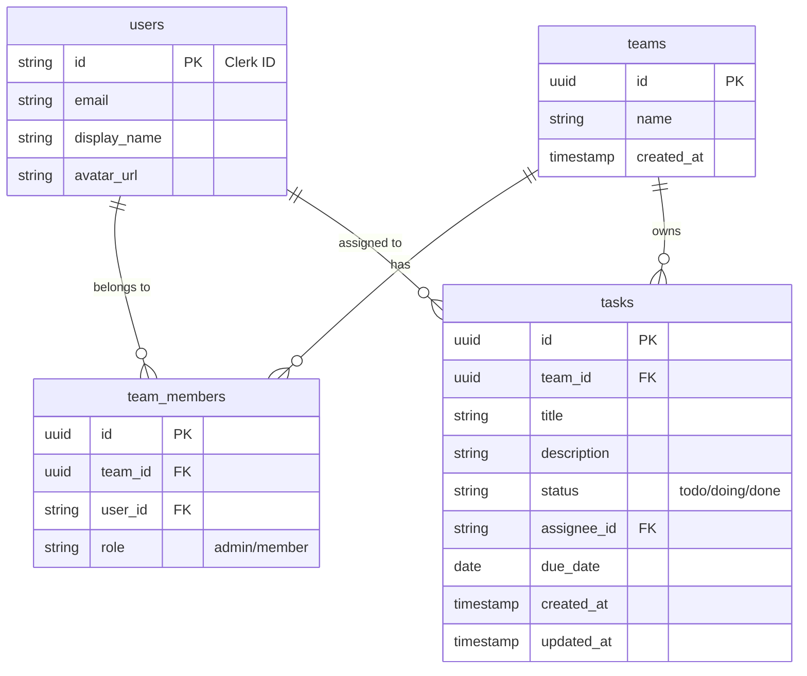
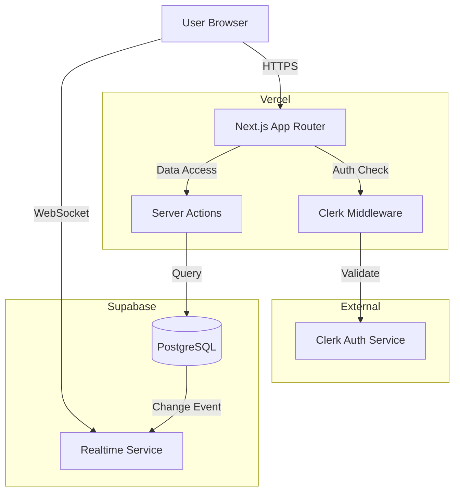

# 詳細要件定義書

## 1. プロジェクト概要

### 1.1. システム概要
「Owaraseru」は、既存の多機能なタスク管理ツールの複雑さを排除し、「タスクを終わらせること」に特化した究極にシンプルなタスク管理アプリケーションです。
開発チームやプロジェクトチームを主要ターゲットとし、シンプルなカンバンボード、必要最小限の通知、集中モードを提供することで、管理コストの削減と生産性向上（定時退社）を実現します。

### 1.2. 目的とゴール
*   **目的**: タスク管理にかかる時間を最小化し、本質的な業務への集中時間を最大化する。
*   **ゴール**:
    *   「進捗確認」コミュニケーションの削減
    *   期限遵守率の向上
    *   チーム全体の残業時間の削減

## 2. ビジネス要件

### 2.1. リーンキャンバス（要約）
*   **課題**: 多機能ツールの複雑さ、通知過多による集中力低下、設定の煩雑さ。
*   **解決策**: 3項目のみのタスク登録、3ステータス固定のカンバン、期限日朝のみの通知、集中モード。
*   **独自の価値提案**: 「終わらせる」ことに特化し、不要な機能を削ぎ落とした "Zen & Focus" な体験。
*   **優位性**: 圧倒的なシンプルさと、エンジニア/PMが本当に欲しい「集中」機能の提供。
*   **顧客セグメント**: 開発チーム、小〜中規模プロジェクトチーム。

### 2.2. KPI / KGI
*   **KGI**: 導入チームの平均残業時間の削減（定性・定量評価）
*   **KPI**:
    *   ユーザーあたりの「完了」タスク数 / 日
    *   期限切れタスク発生率の低下（週次推移）
    *   集中モードの利用回数 / 日

## 3. ユーザー要件

### 3.1. ペルソナ
*   **佐藤 健一 (35歳, PM)**
    *   複数プロジェクトを兼務。メンバーの進捗確認に追われ、自分の作業時間が取れない。
    *   **ニーズ**: チーム全体の状況を一目で把握し、遅れているタスクだけを即座に特定したい。
*   **田中 美咲 (26歳, エンジニア)**
    *   開発タスクに集中したいが、Slackやツールの通知で頻繁に中断される。
    *   **ニーズ**: 今やるべきタスクだけを表示し、誰にも邪魔されない時間が欲しい。

### 3.2. 主要ユーザーストーリー
1.  **PMとして**、チーム全体のタスク状況をカンバンボードで確認し、遅延しているタスク（赤字）を即座に見つけたい。
2.  **エンジニアとして**、朝一番にその日の期限タスク通知を受け取り、今日やるべきことを把握したい。
3.  **エンジニアとして**、「集中モード」をオンにし、25分間通知を遮断してコーディングに没頭したい。
4.  **チームメンバーとして**、複雑な設定なしにタスク名と期限だけで素早くタスクを登録したい。

## 4. 機能要件

### 4.1. 機能一覧 (MoSCoW)
*   **Must (必須)**
    *   ユーザー認証（サインアップ、ログイン、ログアウト）
    *   チーム作成・招待・参加・切替
    *   タスク作成・編集・削除（項目厳選）
    *   カンバンボード表示（未着手・作業中・完了）
    *   タスクステータス移動（D&D）
    *   期限切れタスクのハイライト表示
    *   期限日朝のプッシュ通知
    *   集中モード（通知ブロック・表示フィルタ）
*   **Should (推奨)**
    *   ダークモード対応
*   **Won't (実装しない)**
    *   ガントチャート
    *   タスクの親子関係
    *   工数管理
    *   チャット機能
    *   メール通知

### 4.2. 機能詳細仕様

#### 4.2.1. タスク管理 (F-001)
*   **ユースケース**: ユーザーが新しいタスクを追加する。
*   **入力項目**:
    *   タスク名 (必須, 50文字以内)
    *   担当者 (必須, チームメンバーから選択)
    *   期限 (必須, 日付)
    *   備考 (任意, テキスト)
*   **フロー**:
    1.  「タスク追加」ボタン押下。
    2.  モーダルにて上記項目を入力。
    3.  「作成」押下でDB保存、ボードに即時反映（Supabase Realtime）。

#### 4.2.2. 集中モード (F-004)
*   **ユースケース**: ユーザーが集中して作業を行いたい場合。
*   **動作**:
    1.  ヘッダーの「集中モード」トグルをONにする。
    2.  タイマーが起動（デフォルト25分、カウントダウン表示）。
    3.  **画面変化**: カンバンボードが「自分の担当」かつ「未完了」タスクのみにフィルタリングされる。ヘッダー以外のナビゲーションが非表示になる。
    4.  **通知制御**: アプリ内からのプッシュ通知送出を停止（クライアント側で抑制、またはサーバー側でフラグ管理）。
    5.  タイマー終了または手動OFFで通常モード復帰。

## 5. UI/UX設計

### 5.1. デザインコンセプト
*   **コンセプト**: "Zen & Focus"
*   **カラーパレット**:
    *   Background: #F9FAFB (Light), #111827 (Dark)
    *   Primary: #3B82F6 (Blue - 落ち着いた青)
    *   Accent (Alert): #EF4444 (Red - 遅延時のみ使用)
    *   Text: #1F2937 (Main), #6B7280 (Sub)
*   **タイポグラフィ**: Sans-serif (Inter, Noto Sans JP)

### 5.2. 画面一覧
1.  LP / ログイン画面
2.  チーム選択 / 作成画面
3.  ダッシュボード（カンバンボード）
4.  集中モード画面（ダッシュボードの変形）
5.  設定画面（プロフィール、通知設定）

### 5.3. 画面遷移図 (Mermaid)



### 5.4. ワイヤーフレーム (主要画面)

**カンバンボード**
```text
+-------------------------------------------------------+
| [Logo] チーム名 v  [集中モード(Toggle)]  [UserIcon]   |
+-------------------------------------------------------+
|                                                       |
|  [ 未着手 (3) ]   [ 作業中 (1) ]   [ 完了 (5) ]       |
|  +-----------+   +-----------+   +-----------+        |
|  | タスクA   |   | タスクC   |   | タスクE   |        |
|  | 期限:明日 |   | [User]    |   |           |        |
|  +-----------+   +-----------+   +-----------+        |
|  | タスクB   |                                        |
|  | [alert]   |                                        |
|  +-----------+                                        |
|                                         (+) タスク追加 |
+-------------------------------------------------------+
```

## 6. 非機能要件
*   **パフォーマンス**: 初期ロード1秒以内、ボード操作の他ユーザーへの反映は1秒以内（Realtime）。
*   **セキュリティ**: Clerkによる認証、Row Level Security (RLS) によるデータアクセス制御。
*   **スケーラビリティ**: 初期1,000ユーザー、同時接続100想定。

## 7. データベース設計

### 7.1. ER図 (Mermaid)



### 7.2. テーブル定義 (主要)
*   **tasks**
    *   `id`: UUID, Primary Key
    *   `team_id`: UUID, Foreign Key (teams.id)
    *   `title`: Text, Not Null
    *   `status`: Text, Default 'todo', Check ('todo', 'doing', 'done')
    *   `assignee_id`: Text, Foreign Key (users.id)
    *   `due_date`: Date, Not Null
    *   `description`: Text

## 8. インテグレーション要件

### 8.1. 外部サービス
*   **Clerk**: 認証・ユーザー管理
*   **Supabase**: データベース、リアルタイム配信
*   **Vercel**: ホスティング

### 8.2. API仕様方針
*   Next.js Server Actionsを使用するため、従来のREST APIエンドポイントは原則作成しない。
*   クライアントからServer Actions関数を直接呼び出し、DB操作を行う。
*   型定義はTypeScriptで共有し、API仕様書に代わるものとする。

## 9. 技術選定とアーキテクチャ

### 9.1. アーキテクチャ概要 (Mermaid)



### 9.2. コンポーネント階層図 (Mermaid)

```mermaid
graph TD
    Layout[RootLayout (Server)]
    AuthProvider[ClerkProvider (Client)]
    
    Layout --> AuthProvider
    AuthProvider --> Header[Header (Client)]
    AuthProvider --> Main[Main Content]
    
    Main --> BoardPage[BoardPage (Server)]
    BoardPage --> BoardContainer[BoardContainer (Client)]
    
    BoardContainer --> Column[Column (Client)]
    Column --> TaskCard[TaskCard (Client)]
    TaskCard --> TaskModal[TaskModal (Client)]
    
    Header --> FocusToggle[FocusToggle (Client)]
    Header --> UserMenu[UserMenu (Client)]
```

### 9.3. 実装方針
*   **状態管理**: `SWR` または `TanStack Query` は使用せず、Supabase Realtimeのサブスクリプションで状態を同期する。ローカルUI状態（モーダル開閉など）には `useState` を使用。
*   **Server/Client**:
    *   ページルート (`page.tsx`) はServer Componentとし、初期データをフェッチ。
    *   インタラクティブなボード部分はClient Component (`'use client'`)。

## 10. リスクと課題
*   **Supabase Realtimeの接続制限**: 無料枠の上限に注意し、接続が切れた場合の再接続ロジックを実装する。
*   **プッシュ通知の到達率**: ブラウザの権限設定に依存するため、オンボーディング時に許可を促すUIを工夫する。

## 11. ランニング費用と運用方針 (概算)
*   **Vercel**: Hobbyプラン (無料) - 商用利用時はPro ($20/member/mo)
*   **Supabase**: Freeプラン (無料) - DB容量500MBまで。
*   **Clerk**: Freeプラン (無料) - 月間アクティブユーザー数10,000まで。
*   **運用**: 開発チーム自身が管理者となり運用。エラーログはVercel Logsで監視。

## 12. 変更管理
*   Ver 0.1: 初期作成

## 13. 参考資料
*   `system_requirements.md`

